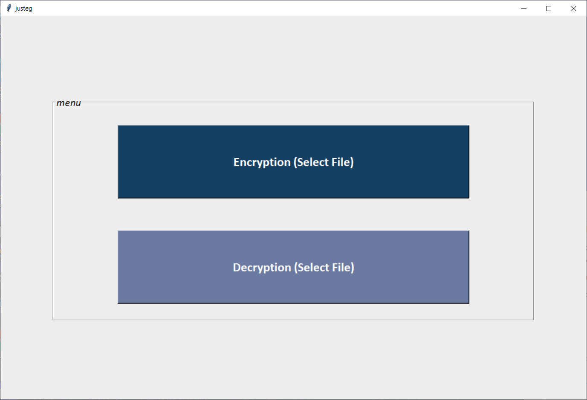
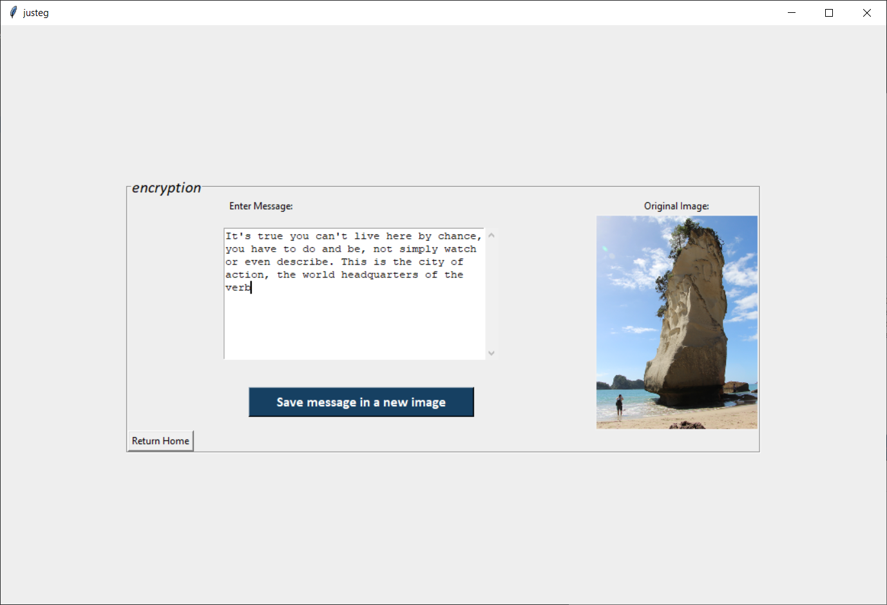
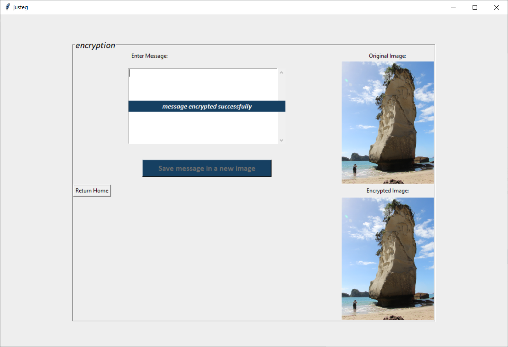
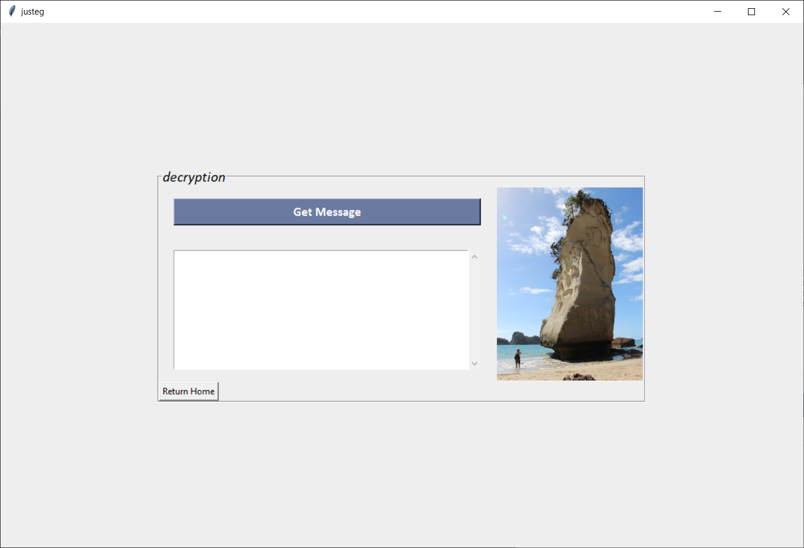
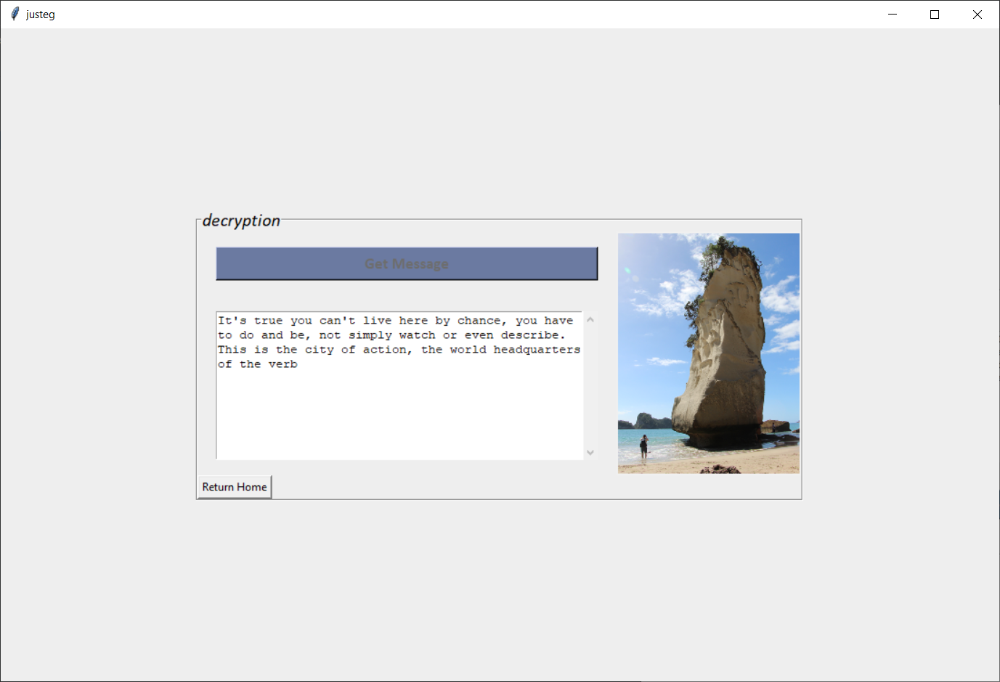

# Steganography

A cool little project to encode messages inside images, this program is also known as **Justeg**.

This name comes from the concept of this project, just a simple **steg**anography software.
Moreover, I like the name because it somewhat resembles Easter eggs which are features that 
developers hide in their programs as a joke. This links to one of the common usages of this program, 
which is to hide funny messages in small images or websites' favicon.

## Disclaimer
This is not a secure cryptography algorithm. Due to the absence of a secret key 
whoever has a copy of the code or knows how the algorithm work can decrypt the message.
The main strength of my approach is that people would really think to look there.
This is because when messages are added, images will still look the same as the 
original ones. Have a go yourself, you will probably find it hard to notice 
the difference by eye.

In the end, Justeg is just a funny way to hide messages inside images.

## Virgil the guide through justeg's inferno

It is important to note that at the current stage this program only allows encrypting ASCII characters.
Furthermore, encryption and decryption operations can only be applied to images in a pbm format.

## Encryption
1. Start by clicking Encryption in the menu frame
2. Then you will be prompted to select a .pbm file through your normal os file dialog.
   Default a folder with some sample images will be opened, feel free to use them or covert your own images (jpg/png) to pbm using GIMP or other editing software
3. After that the encryption frame will be displayed. Containing a text-box where you can type your message to encrypt,
   and the preview of the image that you selected.
4. When you are feeling confident with what you have written press the button 
   'save message in a new image' and Justeg will do the magic
5. Now a file dialog will prompt you to choose where to save the image containing the hidden message
6. Finally, a preview of both images will be displayed to show you that the difference is unnoticeable 

Before                            |  After
:--------------------------------:|:-------------------------:
   |  

## Decryption
1. Start by clicking Decryption in the menu frame
2. Then you will be prompted to select a file through your normal os file dialog.
3. After that the selected image will be displayed on screen (note that this does not imply that a message is hidden in it)

4. Finally, click 'get message' and the message will be shown in the box below

5. If needed you can use the bar on the right to scroll up and down to read the message.

**Note:** Once the message is on the screen there is no timer, it will remain until you go back to the menu or you quit the program 
Once you do so the message will still be inside the image

Before                            |  After
:--------------------------------:|:-------------------------:
   |  

## Erasing encrypted message
to delete the message inside the image you can either delete the .pbm image or overwrite a new message

